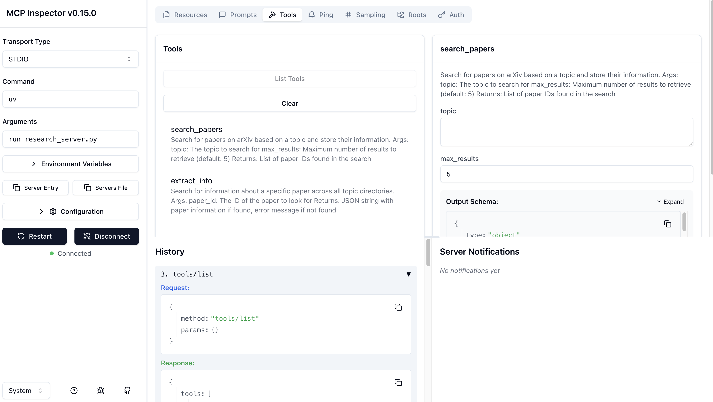

# mcp_demo_gemini

Hello, welcome to Yuanhao's playground !!!

This is a standard MCP demo from the Anthropic course, modified to use Gemini as the large language model. Learning project for the beginers.

The origin example is with Claude, provided on deeplearning.ai: https://learn.deeplearning.ai/courses/mcp-build-rich-context-ai-apps-with-anthropic/lesson/hg6oi/chatbot-example

This project adds a Context Window control so that the conversation could be maintained with a state tracking.
这个项目最大的更新除了模型替换外，还在于引入了Context Window机制使得模型的对话可被延续。

Recommend to use UV to start this project: https://github.com/astral-sh/uv
~~建议安装UV食用此项目，当然不装也可以，但是要手动跑pip install -r requirements.txt~~
为保证requirements.txt和pyproject.toml的一致性，现已删除requirements.txt统一使用UV来使用此项目。

## Start MCP Server:
Navigate to the project directory and initiate it with uv:
```bash
cd <project>
uv init
```
Create virtual environment and activate it:
```bash
uv venv
source .venv/bin/activate
```
Install dependencies:
```bash
uv add mcp arxiv
```
Launch the inspector:
```bash
npx @modelcontextprotocol/inspector uv run research_server.py
```
If you get a message asking "need to install the following packages", type: y

Once the above commands are executed, open the prompted url and you shall see following page:


## Start MCP Client (MCP_Chatbot)
```bash
uv run mcp_chatbot.py
```
You may find some sample prompts in prompt.txt